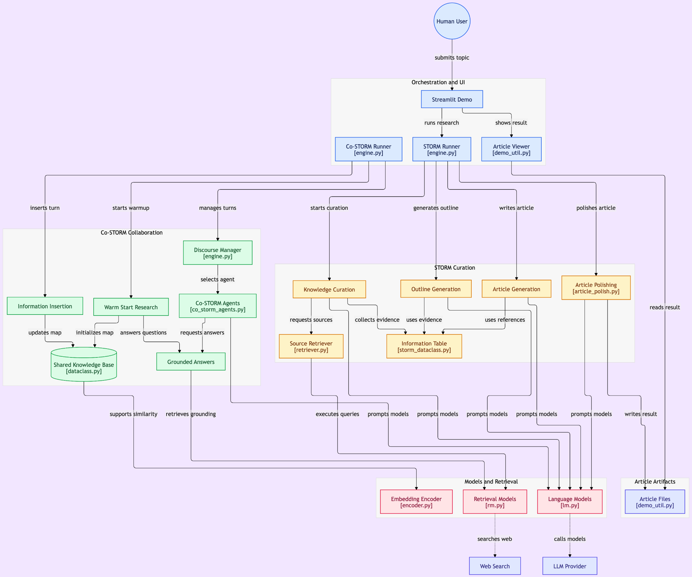
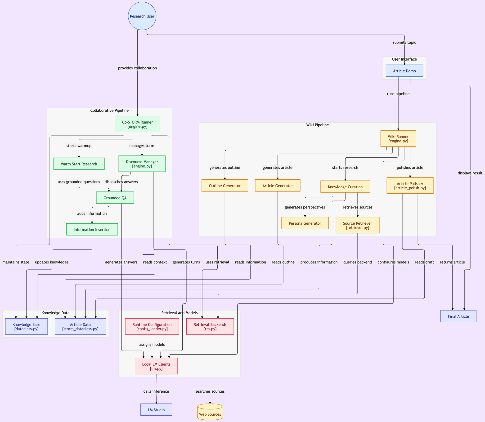

# STORM — Custom Local Multi-Model Automated Research and Writing

An independent custom fork of [Stanford OVAL's STORM](https://github.com/stanford-oval/storm) with locally hosted inference, YAML-based model assignment, dedicated persona-model configuration, retrieval improvements, and execution diagnostics.

---

Research a topic, organize evidence, and generate a Wikipedia-style article with citations using locally hosted language models.

This is [fzolhayat-creator/storm](https://github.com/fzolhayat-creator/storm), an independent customized fork of Stanford OVAL's STORM. STORM stands for **Synthesis of Topic Outlines through Retrieval and Multi-perspective Question Asking**. The original research, STORM and Co-STORM algorithms, and foundational implementation belong to the upstream authors. This fork focuses on an LM Studio execution path for the STORM wiki pipeline.

[Quick start](#quick-start) · [Architecture](#architecture-and-diagram-comparison) · [Configuration](#configuration) · [Limitations](#current-limitations) · [Citation](#citation) · [MIT license](LICENSE)

## Upstream foundation and fork scope

Upstream STORM combines perspective-guided question asking and simulated conversations to gather sources, construct an outline, write an article, and polish the result. Co-STORM adds collaborative discussions, human participation, and a shared knowledge base. Both implementations remain in this repository.

The fork builds on upstream's existing support for assigning different models to pipeline components. Its additions are a dedicated local runner, YAML-based model configuration, and a separate persona-generation model slot.

| Area | Upstream foundation | Custom fork implementation |
| --- | --- | --- |
| Research and writing | Modular knowledge curation, outline, article, and polishing stages | Retains those stages and assigns research and writing model groups in the LM Studio runner |
| Language models | Provider wrappers and component-specific model configuration | Adapts `OpenAIModel` to call an OpenAI-compatible LM Studio chat endpoint directly |
| Persona generation | Uses the question-asking model | Adds `set_persona_generator_lm()` and a dedicated generation-configuration section |
| Configuration | Runner arguments and example-specific model setup | Adds `config_loader.py` and YAML files; the local runner reads model and generation settings |
| Retrieval | Pluggable search engines and document retrieval | Updates the DuckDuckGo adapter to `ddgs`, automatic backend selection, a timeout, and search-error diagnostics |
| HTTP and diagnostics | Existing pipeline summaries and output artifacts | Adds Wikipedia request checks and verbose local-model request, response, finish-reason, and usage output |
| Co-STORM and demo | Collaborative engine and Streamlit article interface | Retained from upstream; the new YAML/LM Studio runner does not automatically configure these entry points |

Local inference still uses online retrieval. Wikipedia, web search, source downloads, and an initial embedding-model download may require internet access. Generated articles need human review for factual accuracy, source quality, and citation support.

## Architecture and diagram comparison

The following are the two supplied [GitDiagram](https://gitdiagram.com/) exports. They are architecture snapshots of the upstream repository and this fork. Open either image at full size to read its labels.

### Original upstream STORM

[](assets/architecture/upstream-storm-gitdiagram.png)

The upstream diagram emphasizes orchestration and the Streamlit interface, the STORM curation stages, Co-STORM collaboration, shared knowledge, embeddings, retrieval, language-model providers, and article files.

### Customized fork

[](assets/architecture/custom-storm-gitdiagram.png)

The custom diagram separates the wiki and collaborative pipelines and highlights the persona generator, runtime configuration, local LM clients, and LM Studio. The major change is the local execution and configuration path; the underlying research-to-article workflow is inherited.

**How to read the differences:** the custom view regroups article data and knowledge-base state and omits the explicit embedding-encoder and article-file boxes visible upstream. Those visual omissions do not mean the implementations were removed. Similarly, connections drawn from the shared model layer to Co-STORM or the demo do not establish that those entry points consume the fork's YAML settings. The concrete local entry point is [`run_storm_wiki_lmstudio.py`](examples/storm_examples/run_storm_wiki_lmstudio.py).

```text
Topic
  -> Research: personas, questions, source-grounded conversations
  -> Collected evidence and references
  -> Outline
  -> Article with citations
  -> Polished article

Research models: persona generation, question asking, conversation simulation
Writing models:  outline generation, article generation, article polishing
Inference:       LM Studio at http://localhost:1234/v1
Retrieval:       selected separately with --retriever
```

## Quick start

### 1. Install this fork from source

Use Python 3.11 for the documented setup (`setup.py` declares Python >=3.10).

```bash
git clone https://github.com/fzolhayat-creator/storm.git
cd storm
python3.11 -m venv .venv
source .venv/bin/activate
python -m pip install --upgrade pip
python -m pip install -e .
python -m pip install PyYAML ddgs
```

The editable installation makes the fork's `knowledge_storm` package available to the example scripts and keeps the repository-relative `configs/` directory accessible. `PyYAML` and `ddgs` are used by the custom configuration loader and DuckDuckGo adapter but are not explicitly listed in `requirements.txt`. Installing the published `knowledge-storm` package alone does not install this fork's changes.

For an existing checkout, start in its repository root—the directory containing `setup.py`, `configs/`, and `knowledge_storm/`—and run the installation steps there.

### 2. Prepare LM Studio

Start LM Studio's OpenAI-compatible server and make the desired models available. The checked-in configuration uses `http://localhost:1234/v1`. Check the model IDs reported by your server:

```bash
curl http://localhost:1234/v1/models
```

Set `lmstudio.api_base` and the two model names in [`configs/model_config.yaml`](configs/model_config.yaml) to match your server. If server authentication is enabled, configure `lmstudio.api_key` accordingly and supply the corresponding bearer token when checking the endpoint.

| Model group | Checked-in model ID | Pipeline roles |
| --- | --- | --- |
| Research | `ornith-1.0-9b` | Persona generation, question asking, conversation simulation |
| Writing | `google/gemma-4-e4b` | Outline generation, article generation, article polishing |

These IDs describe the supplied configuration, not a model compatibility guarantee or a requirement to use those particular models. Both groups can point to the same served model. Capacity, context length, and output quality depend on your selected models and hardware.

### 3. Run the complete wiki pipeline

Run from the repository root. DuckDuckGo does not require a search API key. The runner also attempts to read `secrets.toml`; an empty file is sufficient for this example. `touch` preserves any existing contents, and the file is ignored by Git.

```bash
touch secrets.toml
python examples/storm_examples/run_storm_wiki_lmstudio.py \
    --output-dir ./results/lmstudio \
    --retriever duckduckgo \
    --max-thread-num 1 \
    --do-research \
    --do-generate-outline \
    --do-generate-article \
    --do-polish-article
```

Enter a topic at the `Topic:` prompt. Starting with one worker limits concurrent requests to the local server; increase concurrency if your setup supports it. The `paraphrase-MiniLM-L6-v2` embedding model is used for reference retrieval and may be downloaded on first use.

All four stage flags are needed for a fresh, complete run. When a stage is skipped, later stages may require previously generated artifacts for the same topic and output directory. Available arguments can be inspected with:

```bash
python examples/storm_examples/run_storm_wiki_lmstudio.py --help
```

## Configuration

| File | Current behavior |
| --- | --- |
| [`configs/model_config.yaml`](configs/model_config.yaml) | The local runner reads `lmstudio.api_base`, `lmstudio.api_key`, and the research/writing model names |
| [`configs/generation_config.yaml`](configs/generation_config.yaml) | The runner passes per-stage `temperature`, `top_p`, and `max_tokens` to model constructors, with `global` fallbacks; see the request-forwarding limitation below |
| [`configs/retrieval_config.yaml`](configs/retrieval_config.yaml) | A configuration scaffold with a loader; the local runner does **not** load or apply this file |
| [`knowledge_storm/config_loader.py`](knowledge_storm/config_loader.py) | Resolves YAML files from the repository's `configs/` directory; it supplies data rather than constructing models or retrievers |

Persona generation uses `persona_generation`; question asking and conversation simulation both use `conversation_simulation`. Writing stages use their correspondingly named sections.

Select the retriever explicitly with `--retriever` and control result count with `--search-top-k`. The runner also forwards `--max-conv-turn`, `--max-perspective`, and `--max-thread-num` to the engine. Its listed retrieval choices are `bing`, `you`, `brave`, `serper`, `duckduckgo`, `tavily`, `searxng`, and `azure_ai_search`; provider-specific credentials and services are required where applicable. These inherited alternatives are not all validated for this custom runner.

For providers that need credentials, use environment variables or a local `secrets.toml` containing the keys expected by the selected adapter, such as `YDC_API_KEY`, `BRAVE_API_KEY`, `SERPER_API_KEY`, or `TAVILY_API_KEY`. Values loaded from that file overwrite matching environment variables. See the runner and [`knowledge_storm/rm.py`](knowledge_storm/rm.py) for each integration.

## Outputs and diagnostics

The quick-start command writes artifacts under `results/lmstudio/<topic>/`, with the topic normalized for a directory name.

| Artifact | Contents |
| --- | --- |
| `conversation_log.json` | Research conversations |
| `raw_search_results.json` | Retrieved source information |
| `direct_gen_outline.txt` | Initial outline |
| `storm_gen_outline.txt` | Research-informed outline |
| `storm_gen_article.txt` | Generated article |
| `storm_gen_article_polished.txt` | Polished article |
| `url_to_info.json` | Article reference information |
| `run_config.json` | Model configuration recorded by `post_run()` |
| `llm_call_history.jsonl` | Engine history export; the custom direct HTTP client does not populate its inherited history, so this is not a complete local inference trace |

The local client prints requests and responses, finish reasons, and token usage reported by the server. The runner prints its selected model assignments and generation configuration, then calls the engine summary. These are diagnostic outputs, not a guarantee that every configured parameter reached the server. Prompts and retrieved text can appear in the verbose output.

## Current limitations

- **Generation settings:** `OpenAIModel.request()` forwards supported generation keys supplied at call time. The custom `__call__()` does not merge constructor defaults from `self.kwargs` into those calls. YAML values passed to constructors are therefore not guaranteed to appear in outgoing requests; inspect the printed payload when tuning generation.
- **Inactive runtime fields:** the local runner does not consume the top-level `provider`, `openai_compatible`, per-model `api_base`, or YAML `lmstudio.timeout` fields. Both model groups use `lmstudio.api_base`, and the HTTP timeout is currently hard-coded to 600 seconds in `lm.py`.
- **Retrieval controls:** `retrieval_config.yaml` does not select or configure the active retriever. The DuckDuckGo adapter uses `ddgs` with `backend="auto"` and returns an empty result list after a caught search error. Safe-search and region values accepted by the adapter are not passed into its `ddgs.text()` call.
- **Unused CLI options:** `--retrieve-top-k` and `--remove-duplicate` are parsed by the local runner but are not forwarded to the engine.
- **Inherited entry points:** the Streamlit demo and other STORM examples do not set the fork's new persona-model slot. When adapting them, explicitly call `lm_configs.set_persona_generator_lm(...)` before constructing `STORMWikiRunner`, and review their provider setup. The Co-STORM example has its own model and encoder configuration.
- **Validation scope:** a successful local end-to-end run with Ornith, Gemma, and DuckDuckGo is conducted many times.
```text
                              ┌─────────────┐
                              │  LM Studio  │
                              └──────┬──────┘
                                     │
                     ┌───────────────▼───────────────┐
                     │     OpenAI-Compatible API     │
                     └───────────────┬───────────────┘
                                     │
                              localhost:1234/v1
                                     │
                 ┌───────────────────┴───────────────────┐
                 │                                       │
        ┌────────▼────────┐                    ┌─────────▼─────────┐
        │ Research        │                    │ Writing           │
        │ Pipeline        │                    │ Pipeline          │
        └────────┬────────┘                    └─────────▲─────────┘
                 │                                       │       │
           ornith-1.0-9b                                 │  gemma-4-e4b
                 │                                       │       │
              Persona                                    │       │
                 │                                       │       │
             Questions                                   │       │
                 │                                       │       │
           Conversations                                 │       │
                 │                                       │       │
        DuckDuckGo Retrieval                             │       │
                 │                                       │       │
          Knowledge Table ───────────────────────────────┘       │
                                                                 │
                                                              Outline
                                                                 │
                                                              Article
                                                                 │
                                                              Polish
                                                                 │
                                              ┌──────────────────▼────────────┐
                                              │ Final Wikipedia-style Article │
                                              └───────────────────────────────┘
```
- **Validation claims:** No reproducible run log accompanies that claim in this repository. Treat it as a historical maintainer report, not evidence that every model, provider, or current environment has been tested.

## Repository guide and inherited examples

| Path | Purpose |
| --- | --- |
| [`examples/storm_examples/run_storm_wiki_lmstudio.py`](examples/storm_examples/run_storm_wiki_lmstudio.py) | Custom local CLI entry point |
| [`configs/`](configs/) | Model, generation, and retrieval configuration files |
| [`knowledge_storm/storm_wiki/`](knowledge_storm/storm_wiki/) | STORM wiki runner and research/writing modules |
| [`knowledge_storm/collaborative_storm/`](knowledge_storm/collaborative_storm/) | Inherited Co-STORM engine and modules |
| [`knowledge_storm/lm.py`](knowledge_storm/lm.py) | Language-model clients, including the adapted local client |
| [`knowledge_storm/rm.py`](knowledge_storm/rm.py) | Retrieval adapters |
| [`knowledge_storm/interface.py`](knowledge_storm/interface.py) | Shared pipeline interfaces |
| [`frontend/demo_light/`](frontend/demo_light/) | Inherited Streamlit demo |

The [STORM example guide](examples/storm_examples/README.md), [Co-STORM example](examples/costorm_examples/run_costorm_gpt.py), and [demo setup guide](frontend/demo_light/README.md) remain available as upstream-derived references. Review the limitations above when adapting them to this fork. General upstream API documentation is in the [upstream README](https://github.com/stanford-oval/storm#readme).

For custom-fork questions and changes, use [this fork's issues](https://github.com/fzolhayat-creator/storm/issues) and [pull requests](https://github.com/fzolhayat-creator/storm/pulls). Include your model IDs, relevant configuration, command, and a concise reproduction. The inherited [contribution guide](CONTRIBUTING.md) documents development conventions; its upstream roadmap and acceptance policies should be read in their original context.

## Upstream research and datasets

- [STORM paper](https://arxiv.org/abs/2402.14207): research and generation of Wikipedia-like articles from scratch.
- [Co-STORM paper](https://arxiv.org/abs/2408.15232): human participation in language-model agent conversations.
- [Stanford project website](https://storm-project.stanford.edu/) and [research preview](https://storm.genie.stanford.edu/): upstream resources, separate from this fork's local runner.
- [FreshWiki](https://huggingface.co/datasets/EchoShao8899/FreshWiki) and [WildSeek](https://huggingface.co/datasets/YuchengJiang/WildSeek): datasets released by the upstream researchers.
- [NAACL 2024 code archive](https://github.com/stanford-oval/storm/tree/NAACL-2024-code-backup): the upstream reference for reproducing the original STORM paper experiments. This fork's local configuration is a separate execution setup.

## Attribution and license

This fork retains the [MIT license](LICENSE) and the original notice: **Copyright (c) 2024 Stanford Open Virtual Assistant Lab**. See the license file for the full terms. The fork-specific integration is maintained in [fzolhayat-creator/storm](https://github.com/fzolhayat-creator/storm); it is not an official Stanford release.

Upstream acknowledgements are retained here: Wikipedia provides the source content used by FreshWiki under its Creative Commons Attribution-ShareAlike terms; [Michelle Lam](https://michelle123lam.github.io/) designed the STORM logo; [Dekun Ma](https://dekun.me) led the UI development; and upstream credits Vercel for supporting its research preview. Dataset and source-content terms are distinct from the repository's software license.

The architecture images are the custom [GitDiagram](https://gitdiagram.com/) exports. Their filenames are normalized for repository links; their image contents are unchanged.

## Citation

Please cite the upstream papers when using STORM or Co-STORM in research. These citations credit the original research, independently of the fork's engineering changes.

```bibtex
@inproceedings{jiang-etal-2024-unknown,
    title = "Into the Unknown Unknowns: Engaged Human Learning through Participation in Language Model Agent Conversations",
    author = "Jiang, Yucheng  and
      Shao, Yijia  and
      Ma, Dekun  and
      Semnani, Sina  and
      Lam, Monica",
    editor = "Al-Onaizan, Yaser  and
      Bansal, Mohit  and
      Chen, Yun-Nung",
    booktitle = "Proceedings of the 2024 Conference on Empirical Methods in Natural Language Processing",
    month = nov,
    year = "2024",
    address = "Miami, Florida, USA",
    publisher = "Association for Computational Linguistics",
    url = "https://aclanthology.org/2024.emnlp-main.554/",
    doi = "10.18653/v1/2024.emnlp-main.554",
    pages = "9917--9955",
}

@inproceedings{shao-etal-2024-assisting,
    title = "Assisting in Writing {W}ikipedia-like Articles From Scratch with Large Language Models",
    author = "Shao, Yijia  and
      Jiang, Yucheng  and
      Kanell, Theodore  and
      Xu, Peter  and
      Khattab, Omar  and
      Lam, Monica",
    editor = "Duh, Kevin  and
      Gomez, Helena  and
      Bethard, Steven",
    booktitle = "Proceedings of the 2024 Conference of the North American Chapter of the Association for Computational Linguistics: Human Language Technologies (Volume 1: Long Papers)",
    month = jun,
    year = "2024",
    address = "Mexico City, Mexico",
    publisher = "Association for Computational Linguistics",
    url = "https://aclanthology.org/2024.naacl-long.347/",
    doi = "10.18653/v1/2024.naacl-long.347",
    pages = "6252--6278",
}
```